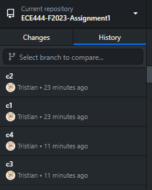
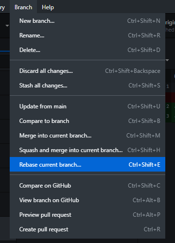
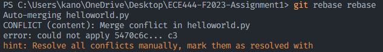

# ECE444-F2023-Assignment1
# YiFeng Chen
## Commit and push:

## Branching and merging:

## Merge conflict resolution:

## Unit test:

## Rebase result:

## Rebase usage:

## Rebase alternative usage:

Tested this usage, and then manually resolved conflict. Later reordered the commits using github windows client.